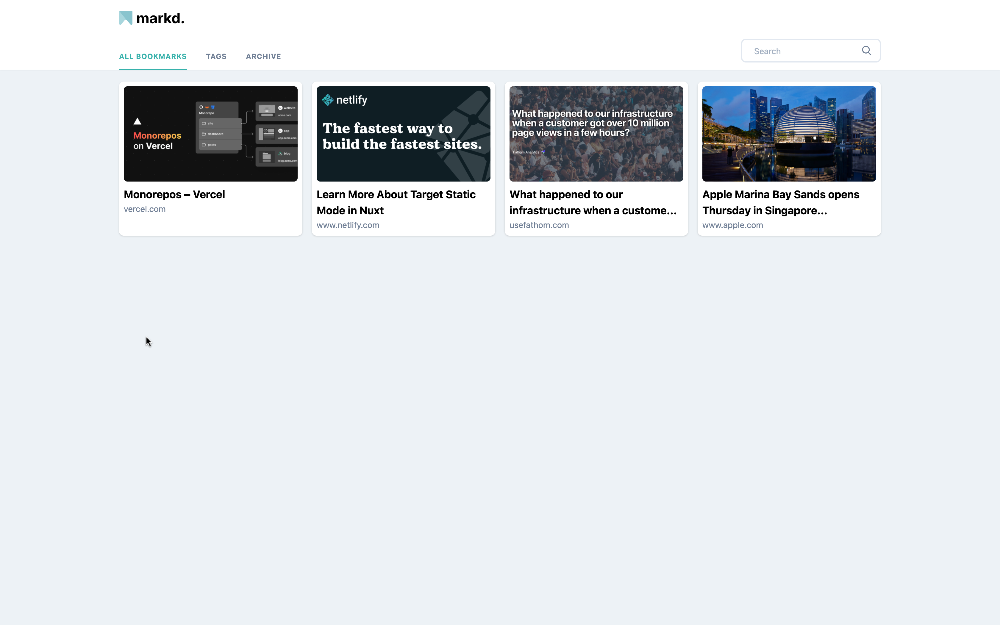
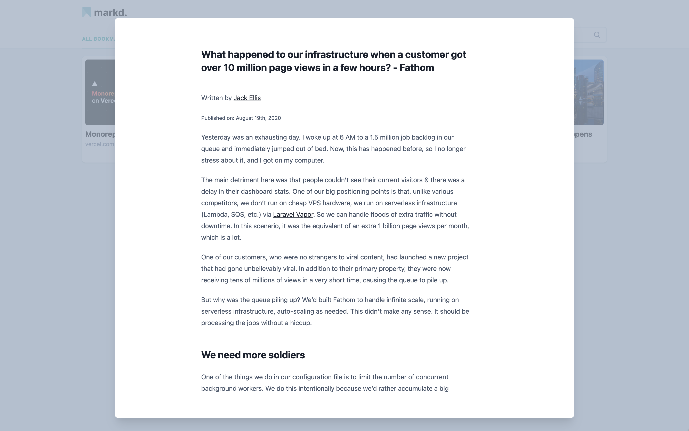

  
  

    A simple bookmarking app that you can host yourself.
     
    <a href="https://markd.frappe.cloud">View Demo</a>
    ·
    <a href="https://github.com/scmmishra/markd/issues/new">Report Bug</a>
    ·
    <a href="https://github.com/scmmishra/markd/issues/new">Request Feature</a>
  

  

    
  

<!-- TABLE OF CONTENTS -->

## Table of Contents

-   [About the Project](#about-the-project)
    -   [Built With](#built-with)
-   [Installation](#installation)
-   [License](#license)
-   [Acknowledgements](#acknowledgements)

<!-- ABOUT THE PROJECT -->

## About The Project

A simple bookmarking app that you can host yourself.

### List View

### Article Preview

### Built With

-   [Frappe Framework](https://github.com/frappe/frappe)
-   [Vue JS](https://vuejs.org)

### Installation

You can install this using [bench](https://github.com/frappe/bench), read the instructions [here](https://frappeframework.com/docs/user/en/installation).

<!-- USAGE EXAMPLES -->

## Usage

Use this space to show useful examples of how a project can be used. Additional screenshots, code examples and demos work well in this space. You may also link to more resources.

_For more examples, please refer to the [Documentation](https://example.com)_

<!-- CONTRIBUTING -->

## Contributing

Contributions are what make the open source community such an amazing place to be learn, inspire, and create. Any contributions you make are **greatly appreciated**.

1. Fork the Project
2. Create your Feature Branch (`git checkout -b feature/AmazingFeature`)
3. Commit your Changes (`git commit -m 'Add some AmazingFeature'`)
4. Push to the Branch (`git push origin feature/AmazingFeature`)
5. Open a Pull Request

<!-- LICENSE -->

## License

Distributed under the MIT License. See `LICENSE` for more information.

<!-- ACKNOWLEDGEMENTS -->

## Acknowledgements

-   [Readme Template](https://github.com/othneildrew/Best-README-Template)
-   [Frappe Framework](https://frappeframework.com)
-   [FOSS United](https://fossunited.org)
